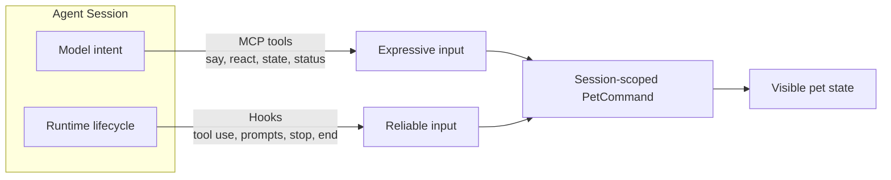
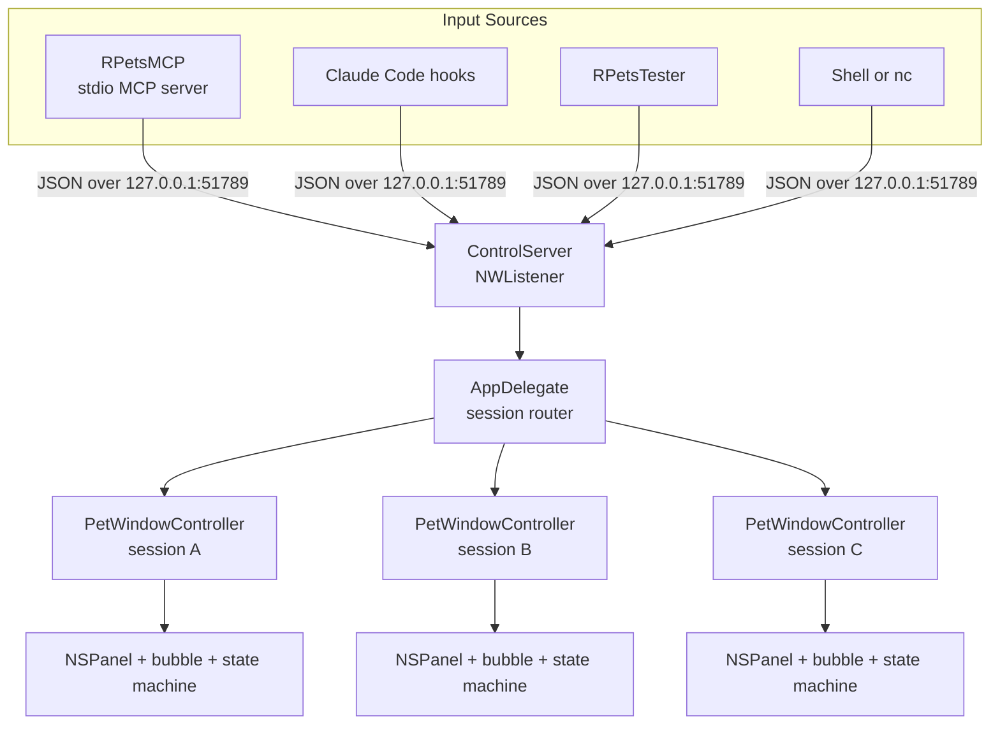
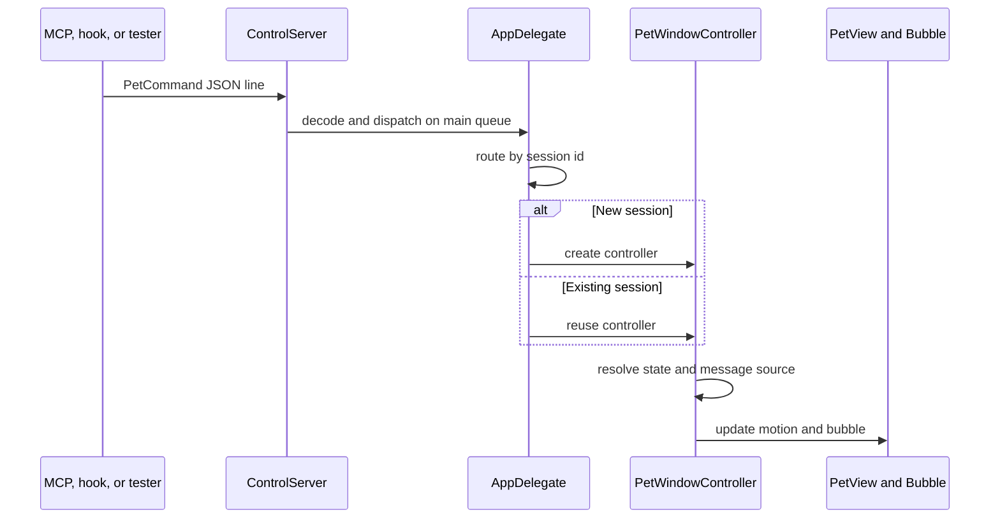
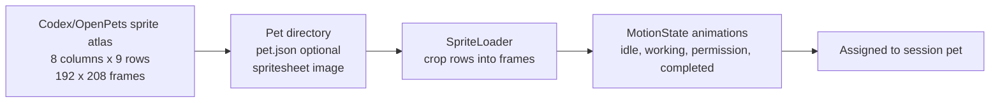
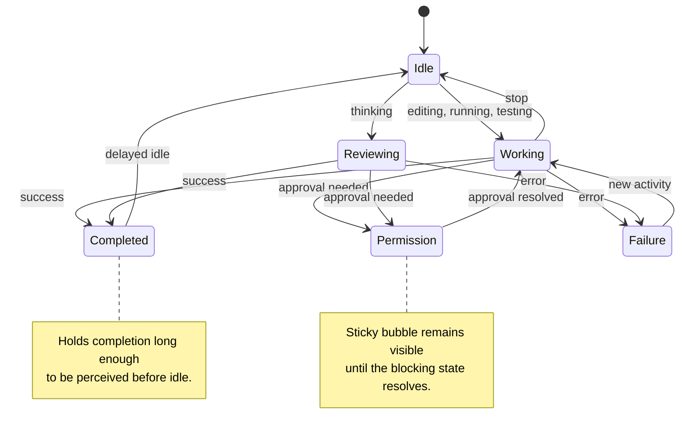

# RPets: A Native Desktop Companion for Multi-Agent Work

I started RPets from a gap I kept feeling in my own workflow.

I liked the idea behind ChatGPT Pets, Codex Pets, and OpenPets: a little animated character that makes an otherwise invisible agent feel present. But the existing versions did not quite fit the way I work. Codex Pets are tied to Codex, while OpenPets is built around a single-agent experience. Neither plays especially well in an environment where I may have four to six different agent sessions running at the same time, each in a different repository or worktree.

What I wanted was not just charm. I wanted peripheral awareness. When I am reviewing one agent's output, waiting on another task, or focusing somewhere else entirely, I still want a visual companion that tells me what each session is doing without making me switch context. Is it thinking? Editing? Running tests? Waiting for my approval? Finished? That information is useful precisely when my attention is already somewhere else.

RPets is my answer to that: a native macOS menu-bar app that can show one desktop pet per agent session. Each pet is small, draggable, always visible, and driven by the real activity of the session it represents.

Under the surface, the project is mostly about turning agent activity into a dependable visual signal without asking the user, or the model, to constantly manage that signal by hand.

## The Input Problem

The main challenge is not drawing a pet on screen. It is knowing what the pet should do.

Agent sessions have different kinds of truth. Some of it is intentional: the model knows when it wants to tell the user "I am refactoring this module" or "Tests are green." Some of it is mechanical: the runtime knows when a tool is about to run, when a Bash command looks like a test, when an edit is happening, when a permission prompt is blocking progress, and when the session has ended.

MCP and hooks each cover one side of that problem.

MCP is the expressive channel. It lets the agent deliberately call `rpets_say`, `rpets_state`, `rpets_react`, or `rpets_status`. That is useful when the model has context the runtime cannot infer, or when a short status bubble helps the user understand what is happening.

Hooks are the reliability channel. They fire from the actual lifecycle of the session, whether or not the model remembers to call a tool. They keep the pet from going stale while files are being edited, commands are running, tests are executing, or approval is needed.

Using only MCP would make the companion depend too much on model behavior. Using only hooks would make it accurate but less expressive. RPets uses both because the experience needs both: automatic enough to stay truthful, intentional enough to feel alive, and resilient enough that it does not feel broken whenever one source of input misses part of the story.



## The Core Shape

RPets has three main pieces:

1. `RPets`, the native macOS app.
2. `RPetsMCP`, a stdio MCP server that exposes tools such as `rpets_state`, `rpets_react`, `rpets_say`, and `rpets_status`.
3. Claude Code hooks that observe real lifecycle events like tool use, permission prompts, notifications, stop events, and session end.

The main app owns the windows and the animation. MCP, hooks, the tester, and shell commands all become input to that same runtime.

At a high level, the app listens for JSON commands over a loopback TCP port:

```json
{ "session": "repo-a", "state": "working", "message": "Refactoring the parser" }
```

The `session` field is the important part. A command with a new session id creates a pet for that session. Future commands with the same session id update that same pet. A close command removes it. That one decision makes the multi-agent model feel natural: there is no global "current pet"; every event already knows which session it came from.

The current transport is newline-delimited JSON over TCP on `127.0.0.1:51789`, implemented with Apple's `Network.framework`. Each sender opens a connection, writes one JSON line, and closes it. That gives the MCP server, hooks, shell tests, and the tester app one shared protocol.

The target architecture goes one step further: a persistent connection per agent session. In that design, the connection lifecycle becomes the pet lifecycle. When the agent starts, the connection opens and the pet appears. When the process exits or crashes, the socket closes and the pet disappears. That removes the need for heartbeat timers, leases, reapers, or cleanup guesses. The current build uses session ids and explicit close commands; the architecture is already shaped so it can grow into the persistent model.



## Why Native Swift

OpenPets solved the desktop-companion problem through Electron. I wanted a different set of tradeoffs.

RPets is a Swift Package with AppKit at the shell and layer-backed rendering for the pet itself. That gives it a few useful properties:

- it can be a menu-bar app without a Dock icon;
- it can create transparent, borderless, always-on-top windows using `NSPanel`;
- it can follow the user across Spaces and fullscreen apps;
- it has no Chromium process just to animate a small sprite;
- it fits naturally into macOS development environments.

Each pet is an `NSPanel` configured as a borderless, non-activating floating panel. The panel is transparent, shadowless, and visible across Spaces:

- `.borderless` and `.nonactivatingPanel` keep it lightweight;
- `.floating` keeps it above normal windows;
- `.canJoinAllSpaces`, `.fullScreenAuxiliary`, and `.stationary` let it stay with the user;
- AppKit mouse events make dragging and hover behavior direct.

The speech bubble is a second child `NSPanel`, positioned relative to the pet. That separation matters. The body animation and the bubble are independent layers: the pet can keep showing a permission bubble while the body temporarily switches to a hover or drag animation.

## How Inputs Become State

Once the app has both input channels, the next question is how to collapse them into a motion vocabulary that stays understandable at a glance.

Claude Code emits events when a prompt is submitted, before a tool runs, after a batch settles, when a notification appears, when permission is requested, and when the session ends. The hook script maps those events into pet states:

- editing tools become `editing`;
- Bash commands become `running`;
- test commands become `testing`;
- prompt submission becomes `thinking`;
- permission and elicitation events become `waiting`;
- stop events return the pet to `idle`;
- failures become `failure`;
- session end closes the pet.

MCP commands use the same destination vocabulary. A deliberate `rpets_say` can add a bubble without changing the body animation. A deliberate `rpets_react` can trigger a success, error, celebration, or wave. Both sources converge on the same `PetCommand` shape before the app decides what to show.

## The App Runtime

The main application is the place where the external signals become visible behavior.

`ControlServer` listens on loopback TCP. It receives newline-delimited JSON, decodes each line into a `PetCommand`, and dispatches it back to the main queue. A command can carry an `action`, a `state`, a `message`, a `session`, and a `source`.

The same port is used by everything:

- `RPetsMCP` forwards MCP tool calls to the app;
- the Claude hook script sends lifecycle updates;
- `RPetsTester` sends manual commands for development;
- a shell can send one-off commands with `nc`.

For example:

```bash
printf '{"session":"demo","state":"working","message":"Reading the diff"}\n' | nc 127.0.0.1 51789
```

Because the protocol is JSON over a local socket, the tester does not need a privileged integration path. It is another client of the same system. The tester creates session ids, picks a target session, and sends the same commands the hooks and MCP server send. That makes it useful for UI development: I can exercise state changes, bubbles, close behavior, and multi-pet layout without launching a real agent session.

From there, `AppDelegate` routes by session id. A new session creates a `PetWindowController`; an existing session updates its controller; a close command removes only that pet. The controller owns the transparent pet `NSPanel`, the bubble panel, and the state machine. `PetView` handles the direct interaction layer: hover, dragging, directional movement, and the final choice of which sprite row is currently visible.

Messages also carry a `source`. MCP messages are deliberate; hook messages are automatic. The state machine uses that distinction when deciding bubble priority. A deliberate MCP bubble should not be immediately overwritten by a generic permission hook, while a permission prompt should stay visible once it is the active thing the user needs to see.



## Pet Assets and Reuse

The pet format is another place where the project intentionally borrows instead of inventing.

RPets uses the Codex/OpenPets-style sprite atlas: an 8-column by 9-row spritesheet, with 192 by 208 pixel frames. Each row represents a motion state: idle, movement, wave, completed, failure, permission, working, reviewing, and so on.

Adopting that standard keeps the pet artwork reusable. A compatible sprite sheet can move between ecosystems without a custom renderer, a plugin API, or Swift code for every character. RPets only needs to resolve the pet directory, read `pet.json` when present, find the spritesheet, and crop the expected rows into animations.

The app autodiscovers pet directories from `~/rpets/` and falls back to a bundled pet when none are installed. Pet assignment is randomized/rotated across sessions to keep parallel work visually fresh without adding a separate pet-management system.



## The State Machine

The most interesting part of the project is not the socket or the window. It is the state machine that sits between raw commands and visible behavior.

A naive version of RPets would set the animation immediately on every incoming event. That works until real agent workflows create contradictory signals:

- an agent finishes successfully and immediately emits an idle event;
- a permission prompt arrives while a more specific message is still readable;
- a hook wants to show "waiting" while the model has just said something deliberate;
- a bubble should disappear when work resumes but stay visible through hover.

RPets handles this through `PetSessionStateMachine` and per-state behavior objects.

The state machine owns the current session motion. On every requested transition, the active behavior decides whether to allow it immediately, reject it, or delay it. That gives individual states their own policy without turning the whole controller into nested conditionals.

For example, `completed` has a grace period. When a task finishes, the completed animation should be visible long enough for the user to perceive it. If an automatic idle event arrives immediately after completion, `CompletedStateBehavior` delays that transition. Other transitions, such as a new permission request or a failure, can still interrupt immediately.

`permission` has a different policy. Its bubble is sticky because it represents a blocked workflow. But it also respects a fresh normal bubble for a short hold window, so a generic permission message does not instantly overwrite a deliberate model message the user has not had time to read.

This is the kind of interaction design that only shows up when the app is attached to a real workflow. The state machine is less about animation theory and more about preserving the meaning of events when they arrive close together.



## Installation and Reversal

The Claude integration is designed to be additive and reversible.

`make install` builds the release `RPetsMCP` binary and runs the installer script. The installer copies the hook script into `~/.claude/hooks`, copies the MCP binary into `~/.claude/RPetsMCP`, registers it as a user-scoped Claude MCP server, writes hook entries into `~/.claude/settings.json`, and adds a single import line to `~/.claude/CLAUDE.md` for the RPets usage instructions.

The remove path undoes those same changes surgically. It removes only hook entries that point to the RPets hook, unregisters the MCP server, deletes the copied binary and instruction file, and removes the import line. The settings file is backed up before writes, and install is idempotent, so re-running it updates the integration without duplicating entries.

That matters because this kind of tool lives close to a developer's environment. Installation should not feel like a trap. A good local agent integration should be easy to try, easy to update, and easy to remove.

```mermaid
flowchart LR
    Install["make install"] --> Build["Build RPetsMCP"]
    Build --> Copy["Copy hook, MCP binary, instructions"]
    Copy --> Register["Register Claude MCP server"]
    Register --> Settings["Merge hook settings"]

    Settings --> Active["RPets integration active"]

    Active --> Remove["make remove"]
    Remove --> Unregister["Unregister MCP server"]
    Unregister --> Cleanup["Remove RPets hook entries and copied files"]
```



## What This Architecture Buys

The design is intentional about where it expands. New machinery appears when a real workflow asks for it, not because the project needs to feel more complete on paper. The state machine is a good example: it exists because real agent sessions produce overlapping signals that need policy, delay, priority, and interruption rules.

The architecture leans on a few focused decisions:

- native AppKit panels for desktop presence;
- one session id per pet;
- one local JSON command protocol;
- MCP for deliberate agent expression;
- hooks for automatic truth;
- a Codex/OpenPets-compatible sprite atlas for easy pet imports;
- a state machine for the messy edge cases of real workflows.

The result is a project that feels playful on the surface but is mostly about systems boundaries. The pet is cute because the system underneath it is disciplined: inputs are constrained, ownership is clear, state transitions are explicit, and compatibility is treated as part of the design.
